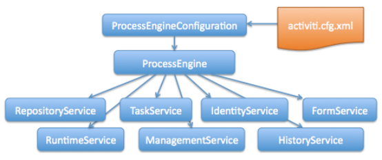
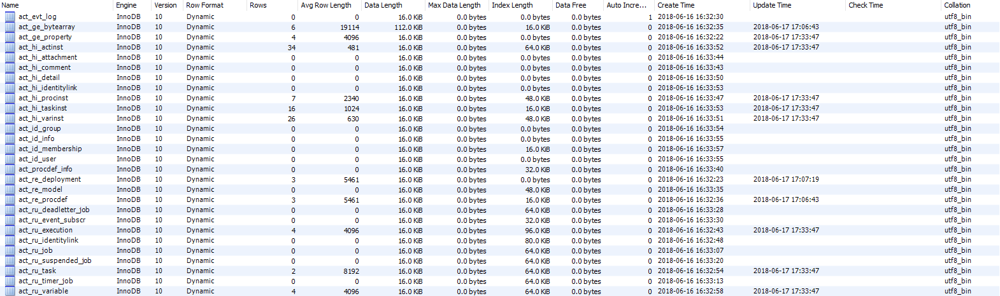
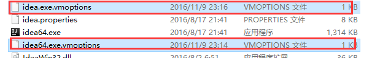
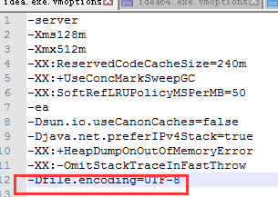
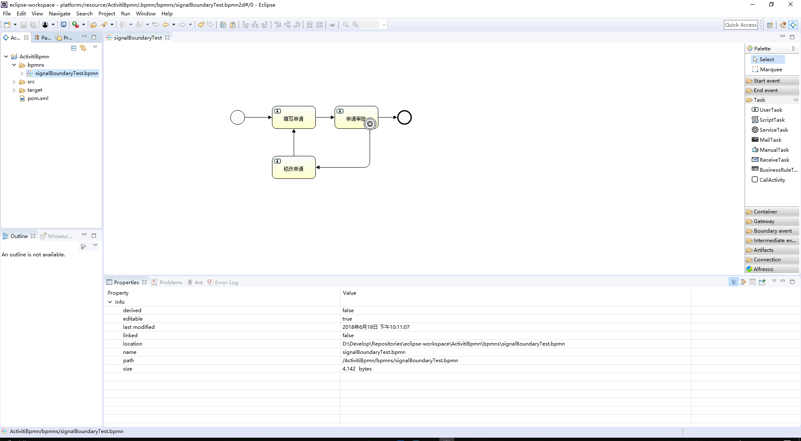

## 目录
> * [Activiti服务](#activitiService)
> * [Activiti数据库](#activitiDatabase)
> * [Activiti与SpringBoot集成](#activitiAndSpringBoot)
> * [采坑总结](#issue)
> * [参考资料](#docs)

## Activiti服务
<div id="activitiService"></div>



1. RepositoryService: Activiti 中每一个不同版本的业务流程的定义都需要使用一些定义文件，部署文件和支持数据 ( 例如 BPMN2.0 XML 文件，表单定义文件，流程定义图像文件等 )，这些文件都存储在 Activiti 内建的 Repository 中。Repository Service 提供了对 repository 的存取服务。
2. RuntimeService: 在 Activiti 中，每当一个流程定义被启动一次之后，都会生成一个相应的流程对象实例。Runtime Service 提供了启动流程、查询流程实例、设置获取流程实例变量等功能。此外它还提供了对流程部署，流程定义和流程实例的存取服务。
3. TaskService: 在 Activiti 中业务流程定义中的每一个执行节点被称为一个 Task，对流程中的数据存取，状态变更等操作均需要在 Task 中完成。Task Service 提供了对用户 Task 和 Form 相关的操作。它提供了运行时任务查询、领取、完成、删除以及变量设置等功能。
4. IdentityService: Activiti 中内置了用户以及组管理的功能，必须使用这些用户和组的信息才能获取到相应的 Task。Identity Service 提供了对 Activiti 系统中的用户和组的管理功能。
5. ManagementService: 提供了对 Activiti 流程引擎的管理和维护功能，这些功能不在工作流驱动的应用程序中使用，主要用于 Activiti 系统的日常维护。
6. HistoryService: 用于获取正在运行或已经完成的流程实例的信息，与 Runtime Service 中获取的流程信息不同，历史信息包含已经持久化存储的永久信息，并已经被针对查询优化。
7. FormService: Activiti 中的流程和状态 Task 均可以关联业务相关的数据。通过使用 Form Service 可以存取启动和完成任务所需的表单数据并且根据需要来渲染表单。

## Activiti数据库
<div id="activitiDatabase"></div>



所有的表都以ACT_开头。 第二部分是表示表的用途的两个字母标识。 服务API的命名也大略符合这个规则。 

1. ACT_RE_*: ‘RE’表示repository。 这个前缀的表包含了流程定义和流程静态资源 （图片，规则，等等）。 
2. ACT_RU_*: ‘RU’表示runtime。 这些运行时的表，包含流程实例，任务，变量，异步任务，等运行中的数据。 
Activiti只在流程实例执行过程中保存这些数据， 在流程结束时就会删除这些记录。 这样运行时表可以一直很小速度很快。 
3. ACT_ID_*: ‘ID’表示identity。 这些表包含身份信息，比如用户，组等等。 
4. ACT_HI_*: ‘HI’表示history。 这些表包含历史数据，比如历史流程实例， 变量，任务等等。 
5. ACT_GE_*: 通用数据， 用于不同场景下，如存放资源文件。
6. ACT_EVT_*:事件表。主要存放事件信息和事件日志等。
7. ACT_PROCDEF_*:流程定义表，流程定义历史更新数据。

<table style="width: 100%;" border="1" cellspacing="0" cellpadding="0">
    <thead>
        <tr>
            <th width="30%">表分类</th>
            <th width="30%">表名</th>
            <th width="40%">解释</th>
        </tr>
    </thead>
    <tbody>
        <tr>
            <td width="30%">事件日志数据</td>
            <td width="30%">ACT_EVT_LOG</td>
            <td width="40%">事件日志</td>
        </tr>
        <tr>
            <td rowspan="2" width="30%">一般数据</td>
            <td width="30%">ACT_GE_BYTEARRAY</td>
            <td width="40%">通用的流程定义和流程资源</td>
        </tr>
        <tr>
            <td width="30%">ACT_GE_PROPERTY</td>
            <td width="40%">系统相关属性</td>
        </tr>
        <tr>
            <td rowspan="8" width="30%">流程历史记录</td>
            <td width="30%">ACT_HI_ACTINST</td>
            <td width="40%">历史的流程实例</td>
        </tr>
        <tr>
            <td width="30%">ACT_HI_ATTACHMENT</td>
            <td width="40%">历史的流程附件</td>
        </tr>
        <tr>
            <td width="30%">ACT_HI_COMMENT</td>
            <td width="40%">历史的说明性信息</td>
        </tr>
        <tr>
            <td width="30%">ACT_HI_DETAIL</td>
            <td width="40%">历史的流程运行中的细节信息</td>
        </tr>
        <tr>
            <td width="30%">ACT_HI_IDENTITYLINK</td>
            <td width="40%">历史的流程运行过程中用户关系</td>
        </tr>
        <tr>
            <td width="30%">ACT_HI_PROCINST</td>
            <td width="40%">历史的流程实例</td>
        </tr>
        <tr>
            <td width="30%">ACT_HI_TASKINST</td>
            <td width="40%">历史的任务实例</td>
        </tr>
        <tr>
            <td width="30%">ACT_HI_VARINST</td>
            <td width="40%">历史的流程运行中的变量信息</td>
        </tr>
        <tr>
            <td rowspan="4" width="30%">用户用户组表</td>
            <td width="30%">ACT_ID_GROUP</td>
            <td width="40%">身份信息-组信息</td>
        </tr>
        <tr>
            <td width="30%">ACT_ID_INFO</td>
            <td width="40%">身份信息-组信息</td>
        </tr>
        <tr>
            <td width="30%">ACT_ID_MEMBERSHIP</td>
            <td width="40%">身份信息-用户和组关系的中间表</td>
        </tr>
        <tr>
            <td width="30%">ACT_ID_USER</td>
            <td width="40%">身份信息-用户信息</td>
        </tr>
        <tr>
            <td width="30%">流程定义更新信息表</td>
            <td width="30%">ACT_PROCDEF_INFO</td>
            <td width="40%">流程定义更新信息</td>
        </tr>
        <tr>
            <td rowspan="3" width="30%">流程定义表</td>
            <td width="30%">ACT_RE_DEPLOYMENT</td>
            <td width="40%">部署单元信息</td>
        </tr>
        <tr>
            <td width="30%">ACT_RE_MODEL</td>
            <td width="40%">模型信息</td>
        </tr>
        <tr>
            <td width="30%">ACT_RE_PROCDEF</td>
            <td width="40%">已部署的流程定义</td>
        </tr>
        <tr>
            <td rowspan="9" width="30%">运行实例表</td>
            <td width="30%">ACT_RU_EVENT_SUBSCR</td>
            <td width="40%">运行时事件</td>
        </tr>
        <tr>
            <td width="30%">ACT_RU_EXECUTION</td>
            <td width="40%">运行时流程执行实例</td>
        </tr>
        <tr>
            <td width="30%">ACT_RU_IDENTITYLINK</td>
            <td width="40%">运行时用户关系信息</td>
        </tr>
        <tr>
            <td width="30%">ACT_RU_JOB</td>
            <td width="40%">运行时作业</td>
        </tr>
        <tr>
            <td width="30%">ACT_RU_DEADLETTER_JOB</td>
            <td width="40%">无效的作业</td>
        </tr>
        <tr>
            <td width="30%">ACT_RU_SUSPENDED_JOB</td>
            <td width="40%">暂停的作业</td>
        </tr>
        <tr>
            <td width="30%">ACT_RU_TIMER_JOB</td>
            <td width="40%">定时的作业</td>
        </tr>
        <tr>
            <td width="30%">ACT_RU_TASK</td>
            <td width="40%">运行时任务</td>
        </tr>
        <tr>
            <td width="30%">ACT_RU_VARIABLE</td>
            <td width="40%">运行时变量表</td>
        </tr>
    </tbody>
</table>

## Activiti与SpringBoot集成
<div id="activitiAndSpringBoot"></div>

Activiti与SpringBoot集成很简单，创建一个类继承`AbstractProcessEngineAutoConfiguration`，然后注入`SpringProcessEngineConfiguration`就可以
``` java
@Configuration
public class ActivitiConfig extends AbstractProcessEngineAutoConfiguration {

    @Bean
    public SpringProcessEngineConfiguration springProcessEngineConfiguration(@Qualifier("dataSource") DataSource dataSource,
                                                                             @Qualifier("transactionManager") PlatformTransactionManager transactionManager,
                                                                             SpringAsyncExecutor springAsyncExecutor) throws IOException {
        SpringProcessEngineConfiguration springProcessEngineConfiguration = this.baseSpringProcessEngineConfiguration(dataSource, transactionManager, springAsyncExecutor);
        springProcessEngineConfiguration.setActivityFontName("宋体");
        springProcessEngineConfiguration.setAnnotationFontName("宋体");
        springProcessEngineConfiguration.setLabelFontName("宋体");
        return springProcessEngineConfiguration;
    }
}
```

## 采坑总结
<div id="issue"></div>

#### 无法启动，`class path resource [processes/] cannot be resolved to URL because it does not exist spring.activiti.check-process-definitions=false`
``` java
    org.springframework.beans.factory.UnsatisfiedDependencyException: Error creating bean with name 'indexController': Unsatisfied dependency expressed through field 'repositoryService'; nested exception is org.springframework.beans.factory.UnsatisfiedDependencyException: Error creating bean with name 'repositoryServiceBean' defined in class path resource [com/voidforce/activiti/config/ActivitiConfig.class]: Unsatisfied dependency expressed through method 'repositoryServiceBean' parameter 0; nested exception is org.springframework.beans.factory.UnsatisfiedDependencyException: Error creating bean with name 'processEngine' defined in class path resource [com/voidforce/activiti/config/ActivitiConfig.class]: Unsatisfied dependency expressed through method 'processEngine' parameter 0; nested exception is org.springframework.beans.factory.BeanCreationException: Error creating bean with name 'springProcessEngineConfiguration' defined in class path resource [com/voidforce/activiti/config/ActivitiConfig.class]: Bean instantiation via factory method failed; nested exception is org.springframework.beans.BeanInstantiationException: Failed to instantiate [org.activiti.spring.SpringProcessEngineConfiguration]: Factory method 'springProcessEngineConfiguration' threw exception; nested exception is java.io.FileNotFoundException: class path resource [processes/] cannot be resolved to URL because it does not exist
    at org.springframework.beans.factory.annotation.AutowiredAnnotationBeanPostProcessor$AutowiredFieldElement.inject(AutowiredAnnotationBeanPostProcessor.java:587) ~[spring-beans-5.0.5.RELEASE.jar:5.0.5.RELEASE]
    at org.springframework.beans.factory.annotation.InjectionMetadata.inject(InjectionMetadata.java:91) ~[spring-beans-5.0.5.RELEASE.jar:5.0.5.RELEASE]
    at org.springframework.beans.factory.annotation.AutowiredAnnotationBeanPostProcessor.postProcessPropertyValues(AutowiredAnnotationBeanPostProcessor.java:373) ~[spring-beans-5.0.5.RELEASE.jar:5.0.5.RELEASE]
    at org.springframework.beans.factory.support.AbstractAutowireCapableBeanFactory.populateBean(AbstractAutowireCapableBeanFactory.java:1344) ~[spring-beans-5.0.5.RELEASE.jar:5.0.5.RELEASE]
    at org.springframework.beans.factory.support.AbstractAutowireCapableBeanFactory.doCreateBean(AbstractAutowireCapableBeanFactory.java:578) ~[spring-beans-5.0.5.RELEASE.jar:5.0.5.RELEASE]
    at org.springframework.beans.factory.support.AbstractAutowireCapableBeanFactory.createBean(AbstractAutowireCapableBeanFactory.java:501) ~[spring-beans-5.0.5.RELEASE.jar:5.0.5.RELEASE]
    at org.springframework.beans.factory.support.AbstractBeanFactory.lambda$doGetBean$0(AbstractBeanFactory.java:317) ~[spring-beans-5.0.5.RELEASE.jar:5.0.5.RELEASE]
    at org.springframework.beans.factory.support.DefaultSingletonBeanRegistry.getSingleton(DefaultSingletonBeanRegistry.java:228) ~[spring-beans-5.0.5.RELEASE.jar:5.0.5.RELEASE]
    at org.springframework.beans.factory.support.AbstractBeanFactory.doGetBean(AbstractBeanFactory.java:315) ~[spring-beans-5.0.5.RELEASE.jar:5.0.5.RELEASE]
    at org.springframework.beans.factory.support.AbstractBeanFactory.getBean(AbstractBeanFactory.java:199) ~[spring-beans-5.0.5.RELEASE.jar:5.0.5.RELEASE]
    at org.springframework.beans.factory.support.DefaultListableBeanFactory.preInstantiateSingletons(DefaultListableBeanFactory.java:760) ~[spring-beans-5.0.5.RELEASE.jar:5.0.5.RELEASE]
    at org.springframework.context.support.AbstractApplicationContext.finishBeanFactoryInitialization(AbstractApplicationContext.java:869) ~[spring-context-5.0.5.RELEASE.jar:5.0.5.RELEASE]
    at org.springframework.context.support.AbstractApplicationContext.refresh(AbstractApplicationContext.java:550) ~[spring-context-5.0.5.RELEASE.jar:5.0.5.RELEASE]
    at org.springframework.boot.web.servlet.context.ServletWebServerApplicationContext.refresh(ServletWebServerApplicationContext.java:140) ~[spring-boot-2.0.1.RELEASE.jar:2.0.1.RELEASE]
    at org.springframework.boot.SpringApplication.refresh(SpringApplication.java:759) [spring-boot-2.0.1.RELEASE.jar:2.0.1.RELEASE]
    at org.springframework.boot.SpringApplication.refreshContext(SpringApplication.java:395) [spring-boot-2.0.1.RELEASE.jar:2.0.1.RELEASE]
    at org.springframework.boot.SpringApplication.run(SpringApplication.java:327) [spring-boot-2.0.1.RELEASE.jar:2.0.1.RELEASE]
    at org.springframework.boot.SpringApplication.run(SpringApplication.java:1255) [spring-boot-2.0.1.RELEASE.jar:2.0.1.RELEASE]
    at org.springframework.boot.SpringApplication.run(SpringApplication.java:1243) [spring-boot-2.0.1.RELEASE.jar:2.0.1.RELEASE]
```
启动时默认去检测`resources/processes`目录并加载`bpmn`文件，如果没有会报错。
解决办法是在`resources/processes`中添加`bpmn`文件，或者`application.properties`添加`spring.activiti.check-process-definitions=false`

#### 无法启动，`Error creating bean with name 'requestMappingHandlerMapping'....`
``` java
    org.springframework.beans.factory.BeanCreationException: Error creating bean with name 'requestMappingHandlerMapping' defined in class path resource [org/springframework/boot/autoconfigure/web/servlet/WebMvcAutoConfiguration$EnableWebMvcConfiguration.class]: Invocation of init method failed; nested exception is java.lang.ArrayStoreException: sun.reflect.annotation.TypeNotPresentExceptionProxy
    at org.springframework.beans.factory.support.AbstractAutowireCapableBeanFactory.initializeBean(AbstractAutowireCapableBeanFactory.java:1702) ~[spring-beans-5.0.5.RELEASE.jar:5.0.5.RELEASE]
    at org.springframework.beans.factory.support.AbstractAutowireCapableBeanFactory.doCreateBean(AbstractAutowireCapableBeanFactory.java:579) ~[spring-beans-5.0.5.RELEASE.jar:5.0.5.RELEASE]
    at org.springframework.beans.factory.support.AbstractAutowireCapableBeanFactory.createBean(AbstractAutowireCapableBeanFactory.java:501) ~[spring-beans-5.0.5.RELEASE.jar:5.0.5.RELEASE]
    at org.springframework.beans.factory.support.AbstractBeanFactory.lambda$doGetBean$0(AbstractBeanFactory.java:317) ~[spring-beans-5.0.5.RELEASE.jar:5.0.5.RELEASE]
    at org.springframework.beans.factory.support.DefaultSingletonBeanRegistry.getSingleton(DefaultSingletonBeanRegistry.java:228) ~[spring-beans-5.0.5.RELEASE.jar:5.0.5.RELEASE]
    at org.springframework.beans.factory.support.AbstractBeanFactory.doGetBean(AbstractBeanFactory.java:315) ~[spring-beans-5.0.5.RELEASE.jar:5.0.5.RELEASE]
    at org.springframework.beans.factory.support.AbstractBeanFactory.getBean(AbstractBeanFactory.java:199) ~[spring-beans-5.0.5.RELEASE.jar:5.0.5.RELEASE]
    at org.springframework.beans.factory.support.DefaultListableBeanFactory.preInstantiateSingletons(DefaultListableBeanFactory.java:760) ~[spring-beans-5.0.5.RELEASE.jar:5.0.5.RELEASE]
    at org.springframework.context.support.AbstractApplicationContext.finishBeanFactoryInitialization(AbstractApplicationContext.java:869) ~[spring-context-5.0.5.RELEASE.jar:5.0.5.RELEASE]
    at org.springframework.context.support.AbstractApplicationContext.__refresh(AbstractApplicationContext.java:550) ~[spring-context-5.0.5.RELEASE.jar:5.0.5.RELEASE]
    at org.springframework.context.support.AbstractApplicationContext.jrLockAndRefresh(AbstractApplicationContext.java) ~[spring-context-5.0.5.RELEASE.jar:5.0.5.RELEASE]
    at org.springframework.context.support.AbstractApplicationContext.refresh(AbstractApplicationContext.java) ~[spring-context-5.0.5.RELEASE.jar:5.0.5.RELEASE]
    at org.springframework.boot.web.servlet.context.ServletWebServerApplicationContext.refresh(ServletWebServerApplicationContext.java:140) ~[spring-boot-2.0.1.RELEASE.jar:2.0.1.RELEASE]
    at org.springframework.boot.SpringApplication.refresh(SpringApplication.java:759) [spring-boot-2.0.1.RELEASE.jar:2.0.1.RELEASE]
    at org.springframework.boot.SpringApplication.refreshContext(SpringApplication.java:395) [spring-boot-2.0.1.RELEASE.jar:2.0.1.RELEASE]
    at org.springframework.boot.SpringApplication.run(SpringApplication.java:327) [spring-boot-2.0.1.RELEASE.jar:2.0.1.RELEASE]
    at org.springframework.boot.SpringApplication.run(SpringApplication.java:1255) [spring-boot-2.0.1.RELEASE.jar:2.0.1.RELEASE]
    at org.springframework.boot.SpringApplication.run(SpringApplication.java:1243) [spring-boot-2.0.1.RELEASE.jar:2.0.1.RELEASE]
   ```
去掉`org.activiti.spring.boot.SecurityAutoConfiguration`自动配备:`@SpringBootApplication(exclude = {SecurityAutoConfiguration.class})`

#### actiBPM插件创建流程图中文乱码
找到idea安装目录bin目录下后缀为`.vmoptions`的两个文件，用编辑器打开，在文件末尾添加`-Dfile.encoding=UTF-8`，然后重启idea





#### Activiti Designer
actiBPM插件不好用，建议使用Eclipse Activiti Designer插件编辑bpmn文件


#### 导出图片中文乱码
在`ActivitiConfig`中配置字体，但已存在数据库中的流程图不受影响，所以这个要记得最先设置
``` java
springProcessEngineConfiguration.setActivityFontName("宋体");
springProcessEngineConfiguration.setAnnotationFontName("宋体");
springProcessEngineConfiguration.setLabelFontName("宋体");
```

#### 无法序列化，`org.activiti.engine.ActivitiException: couldn't find a variable type that is able to serialize com.voidforce.activiti.task.ServiceTask@4d79d187`
Activiti 会将模板中使用到的Bean存在表`act_ru_variable`中，所以类必须实现`Serializable`接口。

## 参考资料
<div id="docs"></div>

[SpringBoot集成Activiti](https://spring.io/blog/2015/03/08/getting-started-with-activiti-and-spring-boot)

[Activiti官方文档](https://www.activiti.org/userguide)